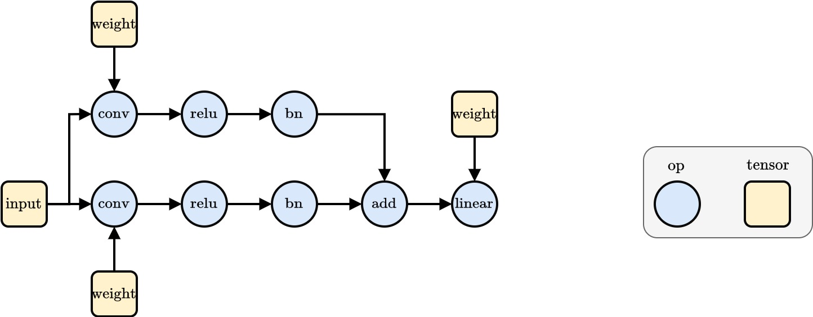
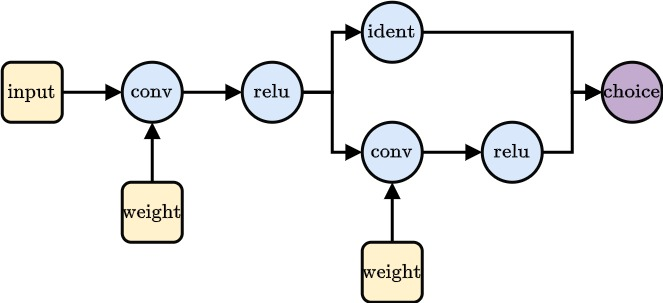

!!! warning
    The search spaces in HANNAH are currently under construction. If you run into bugs, please contact us.


# Search Spaces 

Search spaces in HANNAH are directed graphs (DAGs) where the nodes are **Ops** or **Tensors** and the edges indicate data movement.

!!! note
    Search spaces are not executable themselves but need an [Executor](#executor) which uses the current parametrization state to
    build a `forward`.


```python
from hannah.nas.functional_operators.operators import Conv2d
```



## Basic Building Blocks

### Ops & Tensors

**Op** nodes represent the operators used in the networks of the search space. Their basic syntax is

```python
# usage
var_name = Operator(param0=val0, param1=val1, ...)(*operands)
```

**Tensor** nodes indicate the presence of data in the graph. They do not themselves contain actual values when 
the search space graph is defined (the actual data is managed by the [Executor](#executor)). The tensor node 
defines attributes that the data has at this point in the graph (e.g., shape, axis names, datatypes, ...). 


```python
from hannah.nas.functional_operators.operators import Conv2d
from hannah.nas.functional_operators.op import Tensor

input = Tensor(name='input', shape=(1, 3, 32, 32), axis=("N", "C", "H", "W"))
weight = Tensor(name='weight', shape=(32, 3, 1, 1), axis=("O", "I", "kH", "kW"))

conv = Conv2d(stride=2, dilation=1)   # Define operator and parametrization
graph = conv(input, weight)           # Define/create/extend graph
graph
```


    Conv2d(Conv2d_0)


A set of basic operators is implemented in HANNAH, among them 

* Convolution (1D, 2D)
* Linear
* BatchNorm
* Relu
* Add

and more operators will be added in the future. It is also easy to 
define a new operator, see [Custom Ops](#custom-ops). 

## Parametrization & Expressions

!!! note
    For more information about parametrization and expressions, see [Parametrization](parametrization.md).

To build a search space it is not sufficient to feed scalar values to operator parameters. Instead, one can use 
*parameters*. 


```python
from hannah.nas.parameters.parameters import CategoricalParameter, IntScalarParameter

input = Tensor(name='input', shape=(1, 3, 32, 32), axis=("N", "C", "H", "W"))
weight = Tensor(name='weight', shape=(IntScalarParameter(min=8, max=64, name='out_channels'), 3, 1, 1), axis=("O", "I", "kH", "kW"))

# a search space with stride 1 and stride 2 convolutions
graph = Conv2d(stride=CategoricalParameter(name='stride', choices=[1, 2]))(input, weight)
graph.parametrization(flatten=True)
```


    {'Conv2d_0.weight.out_channels': IntScalarParameter(rng = Generator(PCG64), name = out_channels, id = Conv2d_0.weight.out_channels, min = 8, max = 64, step_size = 1, current_value = 8),
     None: CategoricalParameter(rng = Generator(PCG64), name = stride, id = None, choices = [1, 2], current_value = 1)}


As futher explained in [Parametrization](parametrization.md), parameters are *expressions* and can be combined to more complex *expressions*,
encoding properties of the search space symbolically. One common use-case is symbolically expressing shapes. Consider for example the following:


```python
in_channel = 3 
kernel_size = 1
input = Tensor(name='input',
               shape=(1, in_channel, 32, 32),
               axis=('N', 'C', 'H', 'W'))

weight_0 = Tensor(name='weight', 
                  shape=(IntScalarParameter(min=8, max=64, name='out_channels'), in_channel, kernel_size, kernel_size), 
                  axis=("O", "I", "kH", "kW"))
conv_0 = Conv2d(stride=CategoricalParameter(name='stride', choices=[1, 2]))(input, weight_0)
```

How can we know the output shape of `conv_0`, e.g., to put it into the weight tensor of a following convolution, without knowing what value 
the ``out_channel`` parameter has? 
--> Each node has a method `.shape()` which returns the shape as an expression and can be used interchangeably with actual values. Those expressions
are then only evaluated at sampling and during the forward. 


```python
print("Input shape: ", input.shape())
print("Weight shape: ", weight_0.shape())
print("Convolution output shape:", conv_0.shape())
```

    Input shape:  (1, 3, 32, 32)
    Weight shape:  (IntScalarParameter(rng = Generator(PCG64), name = out_channels, id = Conv2d_0.weight.out_channels, min = 8, max = 64, step_size = 1, current_value = 8), 3, 1, 1)
    Convolution output shape: (1, IntScalarParameter(rng = Generator(PCG64), name = out_channels, id = Conv2d_0.weight.out_channels, min = 8, max = 64, step_size = 1, current_value = 8), <hannah.nas.expressions.arithmetic.Floor object at 0x7ff93a6ce8c0>, <hannah.nas.expressions.arithmetic.Floor object at 0x7ff93a6ce7a0>)


The `lazy` keyword can be used to evaluate values which *might* be parameters (but could also be `int` or else).


```python
from hannah.nas.functional_operators.lazy import lazy


print("Input shape: ", [lazy(i) for i in input.shape()])
print("Weight shape: ", [lazy(i) for i in weight_0.shape()])
print("Convolution output shape:", [lazy(i) for i in conv_0.shape()])
```

    Input shape:  [1, 3, 32, 32]
    Weight shape:  [8, 3, 1, 1]
    Convolution output shape: [1, 8, 16, 16]


When defining an operator, one also has to define a `shape` function (the default shape function is identity, i.e., ``output_shape == input_shape``). Tensors return their own shape. 

## Graphs and Hierarchy

As seen in the simple examples above, we can chain op and tensor nodes together to create graphs and use parameters to span search spaces.


```python
from hannah.nas.functional_operators.operators import Relu

input = Tensor(name='input',
               shape=(1, 3, 32, 32),
               axis=('N', 'C', 'H', 'W'))

weight_0 = Tensor(name='weight', shape=(IntScalarParameter(min=8, max=64, name='out_channels'), 3, 1, 1), axis=("O", "I", "kH", "kW"))

conv_0 = Conv2d(stride=CategoricalParameter(name='stride', choices=[1, 2]))(input, weight_0)
relu_0 = Relu()(conv_0)

weight_1 = Tensor(name='weight', shape=(IntScalarParameter(min=32, max=64, name='out_channels'), conv_0.shape()[1], 3, 3), axis=("O", "I", "kH", "kW"))
conv_1 = Conv2d(stride=CategoricalParameter(name='stride', choices=[1, 2]))(relu_0, weight_1)
relu_1 = Relu()(conv_1)

```


```python
relu_1.parametrization(flatten=True)
```


    {'Conv2d_1.weight.out_channels': IntScalarParameter(rng = Generator(PCG64), name = out_channels, id = Conv2d_1.weight.out_channels, min = 32, max = 64, step_size = 1, current_value = 32),
     'Conv2d_0.weight.out_channels': IntScalarParameter(rng = Generator(PCG64), name = out_channels, id = Conv2d_0.weight.out_channels, min = 8, max = 64, step_size = 1, current_value = 8),
     'Conv2d_0.stride': CategoricalParameter(rng = Generator(PCG64), name = stride, id = Conv2d_0.stride, choices = [1, 2], current_value = 2),
     'Conv2d_1.stride': CategoricalParameter(rng = Generator(PCG64), name = stride, id = Conv2d_1.stride, choices = [1, 2], current_value = 2)}


Nodes have *operands* for backwards traversal and *users* for forward traversal.
With helper functions like `get_nodes` one can iterate through all graph nodes.


```python
from hannah.nas.functional_operators.op import get_nodes

print("Relu Operands: ", relu_1.operands)
print("Conv Users: ", relu_1.operands[0].users)

print("\nNodes:")
for node in get_nodes(relu_1):
    print('Node:', node)
    print('\tOperands: ', node.operands)

```

    Relu Operands:  [Conv2d(Conv2d_1)]
    Conv Users:  [Relu(Relu_1)]
    
    Nodes:
    Node: Relu(Relu_1)
    	Operands:  [Conv2d(Conv2d_1)]
    Node: Conv2d(Conv2d_1)
    	Operands:  [Relu(Relu_0), Tensor(Conv2d_1.weight)]
    Node: Tensor(Conv2d_1.weight)
    	Operands:  []
    Node: Relu(Relu_0)
    	Operands:  [Conv2d(Conv2d_0)]
    Node: Conv2d(Conv2d_0)
    	Operands:  [Tensor(input), Tensor(Conv2d_0.weight)]
    Node: Tensor(Conv2d_0.weight)
    	Operands:  []
    Node: Tensor(input)
    	Operands:  []


### Blocks

Creating large graphs with a lot of operators and tensors manually can get tedious and convoluted. Instead, we can define search space graphs in a hierarchical manner by encapsulating them in functions:


```python
def conv_relu(input, kernel_size, out_channels, stride):
    in_channels = input.shape()[1]
    weight = Tensor(name='weight',
                    shape=(out_channels, in_channels, kernel_size, kernel_size),
                    axis=('O', 'I', 'kH', 'kW'),
                    grad=True)

    conv = Conv2d(stride=stride)(input, weight)
    relu = Relu()(conv)
    return relu
```


```python
input = Tensor(name='input',
               shape=(1, 3, 32, 32),
               axis=('N', 'C', 'H', 'W'))

kernel_size = CategoricalParameter(name="kernel_size", choices=[1, 3, 5])
stride = CategoricalParameter(name="stride", choices=[1, 2])
out_channels = IntScalarParameter(name="out_channels", min=8, max=64)
net = conv_relu(input, kernel_size=kernel_size, out_channels=out_channels, stride=stride)
net = conv_relu(net, kernel_size=kernel_size, out_channels=out_channels, stride=stride)

for n in get_nodes(net):
    print(n)
```

    Relu(Relu_1)
    Conv2d(Conv2d_1)
    Tensor(Conv2d_1.weight)
    Relu(Relu_0)
    Conv2d(Conv2d_0)
    Tensor(Conv2d_0.weight)
    Tensor(input)


```python
net.parametrization(flatten=True)
```


    {'Conv2d_0.weight.kernel_size': CategoricalParameter(rng = Generator(PCG64), name = kernel_size, id = Conv2d_0.weight.kernel_size, choices = [1, 3, 5], current_value = 5),
     'Conv2d_0.weight.out_channels': IntScalarParameter(rng = Generator(PCG64), name = out_channels, id = Conv2d_0.weight.out_channels, min = 8, max = 64, step_size = 1, current_value = 8),
     'Conv2d_0.stride': CategoricalParameter(rng = Generator(PCG64), name = stride, id = Conv2d_0.stride, choices = [1, 2], current_value = 1)}


Note, how there is just one set of parameters. If defined this way, both blocks share their parameters. To define seperate parameters one can use `param.new()`


```python
input = Tensor(name='input',
               shape=(1, 3, 32, 32),
               axis=('N', 'C', 'H', 'W'))

kernel_size = CategoricalParameter(name="kernel_size", choices=[1, 3, 5])
stride = CategoricalParameter(name="stride", choices=[1, 2])
out_channels = IntScalarParameter(name="out_channels", min=8, max=64)
net = conv_relu(input, kernel_size=kernel_size.new(), out_channels=out_channels.new(), stride=stride.new())
net = conv_relu(net, kernel_size=kernel_size.new(), out_channels=out_channels.new(), stride=stride.new())

net.parametrization(flatten=True)
```


    {'Conv2d_1.weight.kernel_size': CategoricalParameter(rng = Generator(PCG64), name = kernel_size, id = Conv2d_1.weight.kernel_size, choices = [1, 3, 5], current_value = 3),
     'Conv2d_1.weight.out_channels': IntScalarParameter(rng = Generator(PCG64), name = out_channels, id = Conv2d_1.weight.out_channels, min = 8, max = 64, step_size = 1, current_value = 8),
     'Conv2d_0.weight.kernel_size': CategoricalParameter(rng = Generator(PCG64), name = kernel_size, id = Conv2d_0.weight.kernel_size, choices = [1, 3, 5], current_value = 3),
     'Conv2d_0.weight.out_channels': IntScalarParameter(rng = Generator(PCG64), name = out_channels, id = Conv2d_0.weight.out_channels, min = 8, max = 64, step_size = 1, current_value = 8),
     'Conv2d_0.stride': CategoricalParameter(rng = Generator(PCG64), name = stride, id = Conv2d_0.stride, choices = [1, 2], current_value = 2),
     'Conv2d_1.stride': CategoricalParameter(rng = Generator(PCG64), name = stride, id = Conv2d_1.stride, choices = [1, 2], current_value = 2)}


These function blocks can be nested as desired.


```python
def block(input):
    kernel_size = CategoricalParameter(name="kernel_size", choices=[1, 3, 5])
    stride = CategoricalParameter(name="stride", choices=[1, 2])
    out_channels = IntScalarParameter(name="out_channels", min=8, max=64)
    net = conv_relu(input, kernel_size=kernel_size.new(), out_channels=out_channels.new(), stride=stride.new())
    net = conv_relu(net, kernel_size=kernel_size.new(), out_channels=out_channels.new(), stride=stride.new())
    net = conv_relu(net, kernel_size=kernel_size.new(), out_channels=out_channels.new(), stride=stride.new())
    return net

input = Tensor(name='input',
               shape=(1, 3, 32, 32),
               axis=('N', 'C', 'H', 'W'))
net = block(input)
net = block(net)

for n in get_nodes(net):
    print(n)
```

    Relu(Relu_5)
    Conv2d(Conv2d_5)
    Tensor(Conv2d_5.weight)
    Relu(Relu_4)
    Conv2d(Conv2d_4)
    Tensor(Conv2d_4.weight)
    Relu(Relu_3)
    Conv2d(Conv2d_3)
    Tensor(Conv2d_3.weight)
    Relu(Relu_2)
    Conv2d(Conv2d_2)
    Tensor(Conv2d_2.weight)
    Relu(Relu_1)
    Conv2d(Conv2d_1)
    Tensor(Conv2d_1.weight)
    Relu(Relu_0)
    Conv2d(Conv2d_0)
    Tensor(Conv2d_0.weight)
    Tensor(input)


### Scopes

As seen above, while the *definition* of the graph is made in a hierarchical manner, the actual graph and its node are "flat" and do not have any inherent hierarchy. To make the graph more clear and readable one can use **scopes** with the `@scope` decorator for blocks. Note that `@scope` does not have any effect on the inherent structure of the graph but only affects the node `id`s.


```python
from hannah.nas.functional_operators.op import scope


@scope
def conv_relu(input, kernel_size, out_channels, stride):
    in_channels = input.shape()[1]
    weight = Tensor(name='weight',
                    shape=(out_channels, in_channels, kernel_size, kernel_size),
                    axis=('O', 'I', 'kH', 'kW'),
                    grad=True)

    conv = Conv2d(stride=stride)(input, weight)
    relu = Relu()(conv)
    return relu

@scope
def block(input):
    kernel_size = CategoricalParameter(name="kernel_size", choices=[1, 3, 5])
    stride = CategoricalParameter(name="stride", choices=[1, 2])
    out_channels = IntScalarParameter(name="out_channels", min=8, max=64)
    net = conv_relu(input, kernel_size=kernel_size.new(), out_channels=out_channels.new(), stride=stride.new())
    net = conv_relu(net, kernel_size=kernel_size.new(), out_channels=out_channels.new(), stride=stride.new())
    net = conv_relu(net, kernel_size=kernel_size.new(), out_channels=out_channels.new(), stride=stride.new())
    return net

input = Tensor(name='input',
               shape=(1, 3, 32, 32),
               axis=('N', 'C', 'H', 'W'))
net = block(input)
net = block(net)

for n in get_nodes(net):
    print(n)
```

    Relu(block_1.conv_relu_2.Relu_0)
    Conv2d(block_1.conv_relu_2.Conv2d_0)
    Tensor(block_1.conv_relu_2.Conv2d_0.weight)
    Relu(block_1.conv_relu_1.Relu_0)
    Conv2d(block_1.conv_relu_1.Conv2d_0)
    Tensor(block_1.conv_relu_1.Conv2d_0.weight)
    Relu(block_1.conv_relu_0.Relu_0)
    Conv2d(block_1.conv_relu_0.Conv2d_0)
    Tensor(block_1.conv_relu_0.Conv2d_0.weight)
    Relu(block_0.conv_relu_2.Relu_0)
    Conv2d(block_0.conv_relu_2.Conv2d_0)
    Tensor(block_0.conv_relu_2.Conv2d_0.weight)
    Relu(block_0.conv_relu_1.Relu_0)
    Conv2d(block_0.conv_relu_1.Conv2d_0)
    Tensor(block_0.conv_relu_1.Conv2d_0.weight)
    Relu(block_0.conv_relu_0.Relu_0)
    Conv2d(block_0.conv_relu_0.Conv2d_0)
    Tensor(block_0.conv_relu_0.Conv2d_0.weight)
    Tensor(input)


## Choice Ops

A choice op is a special node kind that allows to have multiple paths in the graph that exclude each other (or have other specialized behaviour). 


```python
from hannah.nas.functional_operators.operators import Identity
from functools import partial
from hannah.nas.functional_operators.op import ChoiceOp

@scope
def choice_block(input):
    kernel_size = CategoricalParameter([1, 3, 5], name='kernel_size')
    out_channels = IntScalarParameter(min=4, max=64, name='out_channels')
    stride = CategoricalParameter([1, 2], name='stride')

    identity = Identity()
    optional_conv = partial(conv_relu, out_channels=out_channels.new(), stride=stride.new(), kernel_size=kernel_size.new())
    net = ChoiceOp(identity, optional_conv)(input)
    return net

    
```


```python
input = Tensor(name='input', shape=(1, 3, 32, 32), axis=('N', 'C', 'H', 'W'))
conv = conv_relu(input, out_channels=out_channels.new(), stride=stride.new(), kernel_size=kernel_size.new())
net = choice_block(conv)

net.parametrization(flatten=True)

```


    {'choice_block_0.ChoiceOp_0.choice': IntScalarParameter(rng = Generator(PCG64), name = choice, id = choice_block_0.ChoiceOp_0.choice, min = 0, max = 1, step_size = 1, current_value = 0),
     'choice_block_0.conv_relu_1.Conv2d_0.stride': CategoricalParameter(rng = Generator(PCG64), name = stride, id = choice_block_0.conv_relu_1.Conv2d_0.stride, choices = [1, 2], current_value = 2),
     'choice_block_0.conv_relu_1.Conv2d_0.weight.kernel_size': CategoricalParameter(rng = Generator(PCG64), name = kernel_size, id = choice_block_0.conv_relu_1.Conv2d_0.weight.kernel_size, choices = [1, 3, 5], current_value = 5),
     'choice_block_0.conv_relu_1.Conv2d_0.weight.out_channels': IntScalarParameter(rng = Generator(PCG64), name = out_channels, id = choice_block_0.conv_relu_1.Conv2d_0.weight.out_channels, min = 4, max = 64, step_size = 1, current_value = 4),
     'conv_relu_0.Conv2d_0.stride': CategoricalParameter(rng = Generator(PCG64), name = stride, id = conv_relu_0.Conv2d_0.stride, choices = [1, 2], current_value = 2),
     'conv_relu_0.Conv2d_0.weight.kernel_size': CategoricalParameter(rng = Generator(PCG64), name = kernel_size, id = conv_relu_0.Conv2d_0.weight.kernel_size, choices = [1, 3, 5], current_value = 3),
     'conv_relu_0.Conv2d_0.weight.out_channels': IntScalarParameter(rng = Generator(PCG64), name = out_channels, id = conv_relu_0.Conv2d_0.weight.out_channels, min = 8, max = 64, step_size = 1, current_value = 8)}




!!! note
    When defining options for a choice node, one can either use ops directly (see ``Identity()`` above) or use block functions (``conv_relu``). For block functions, one has to use ``functools.partial`` to enable 
    the choice node to perform the respective integration in the graph.  

During execution, the choice node can be leveraged to define the behaviour (e.g., select one and only one path, execute all paths and return a parametrized sum for differential NAS, ...). Choice nodes can, for example, be used to search over different operator types, different operator patterns, or to implement dynamic depth/a variable amount of layers/blocks.  


```python
def dynamic_depth(*exits, switch):
    return ChoiceOp(*exits, switch=switch)()
```

## Custom Ops

To define custom operators, one can inherit from the ``Op`` class. Then, one can override the ``__call__(self, *operands)`` class to perform specific actions, e.g., saving certain parameters of the operands as fields of the operator instance that is returned. Don't forget to call ``super().__call__(*operands)``, which performs the integration of the new operator instance into the graph. 

Then, one has to provide a ``_forward_implementation(self, *args)``, which defines the computation that the operator executes. 

Lastly, a ``shape_fun(self)`` defines the output shape of the operator.

## Executor

The search space graphs are not themselves executable. For that one needs an ``Executor``. The ``BasicExecutor`` analyzes the graph to find dependencies and a valid node order (e.g., to execute the results of operands first before they are added in an ``Add`` operation) and builds a ``forward`` function. It also registers torch parameters and buffers for training.The executor should be usable as a normal ``torch.nn.Module``. One can define custom executors, e.g., for weight sharing NAS or differential NAS. 


```python
import torch
from hannah.nas.functional_operators.executor import BasicExecutor


input = Tensor(name='input',
               shape=(1, 3, 32, 32),
               axis=('N', 'C', 'H', 'W'))
net = block(input)
net = block(net)

model = BasicExecutor(net)
model.initialize()

x = torch.randn(input.shape())
model.forward(x)
```


    tensor([[[[0.0000, 0.0000, 0.0000, 0.0000],
              [0.0000, 0.0000, 0.0000, 0.0000],
              [0.0000, 0.0000, 0.0000, 0.0000],
              [0.0000, 0.0000, 0.0000, 0.0000]],
    
             [[0.0255, 0.0000, 0.0000, 0.0000],
              [0.0000, 0.0152, 0.0000, 0.0000],
              [0.0000, 0.0000, 0.0898, 0.0000],
              [0.1132, 0.0894, 0.0094, 0.0138]],
    
             [[0.0000, 0.0000, 0.0365, 0.0000],
              [0.0000, 0.1532, 0.0000, 0.2529],
              [0.0000, 0.0859, 0.0396, 0.0000],
              [0.0000, 0.2311, 0.0757, 0.0000]],
    
             [[0.0000, 0.1285, 0.1754, 0.0000],
              [0.1788, 0.1729, 0.1973, 0.1036],
              [0.1823, 0.2994, 0.2293, 0.2580],
              [0.0554, 0.2454, 0.1355, 0.3018]],
    
             [[0.0000, 0.0234, 0.0000, 0.0000],
              [0.0725, 0.0212, 0.0615, 0.0960],
              [0.1040, 0.0960, 0.1613, 0.0927],
              [0.1025, 0.0846, 0.0000, 0.0424]],
    
             [[0.0000, 0.0000, 0.0672, 0.0818],
              [0.0000, 0.1420, 0.0404, 0.0326],
              [0.0000, 0.0000, 0.0000, 0.1140],
              [0.0000, 0.1518, 0.1521, 0.2088]],
    
             [[0.0000, 0.0995, 0.1362, 0.0000],
              [0.0000, 0.1206, 0.0000, 0.0000],
              [0.0000, 0.1001, 0.0000, 0.0000],
              [0.0000, 0.0000, 0.0000, 0.0435]],
    
             [[0.0000, 0.0000, 0.0000, 0.0245],
              [0.0000, 0.0938, 0.0000, 0.0763],
              [0.0000, 0.0000, 0.0000, 0.0000],
              [0.0000, 0.0000, 0.0000, 0.0000]]]], grad_fn=<ReluBackward0>)


