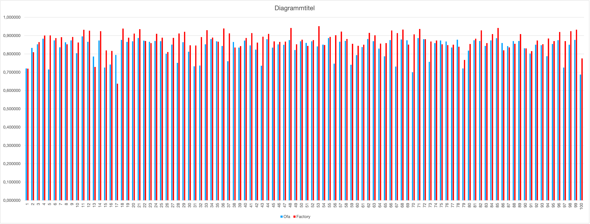
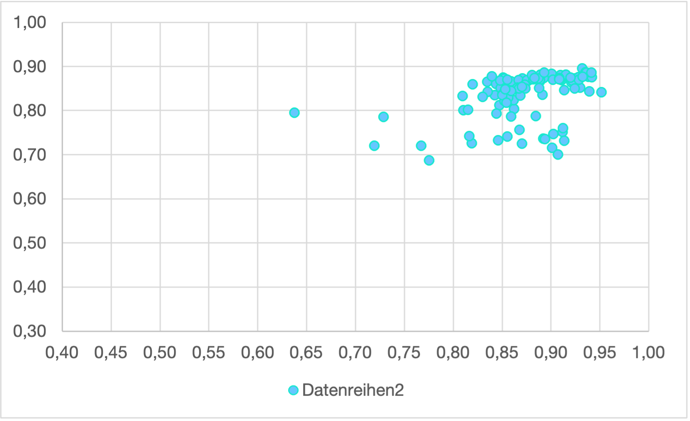
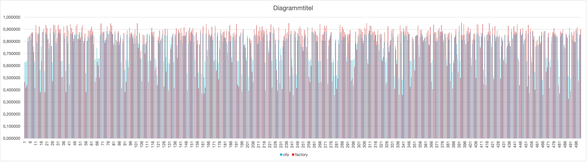
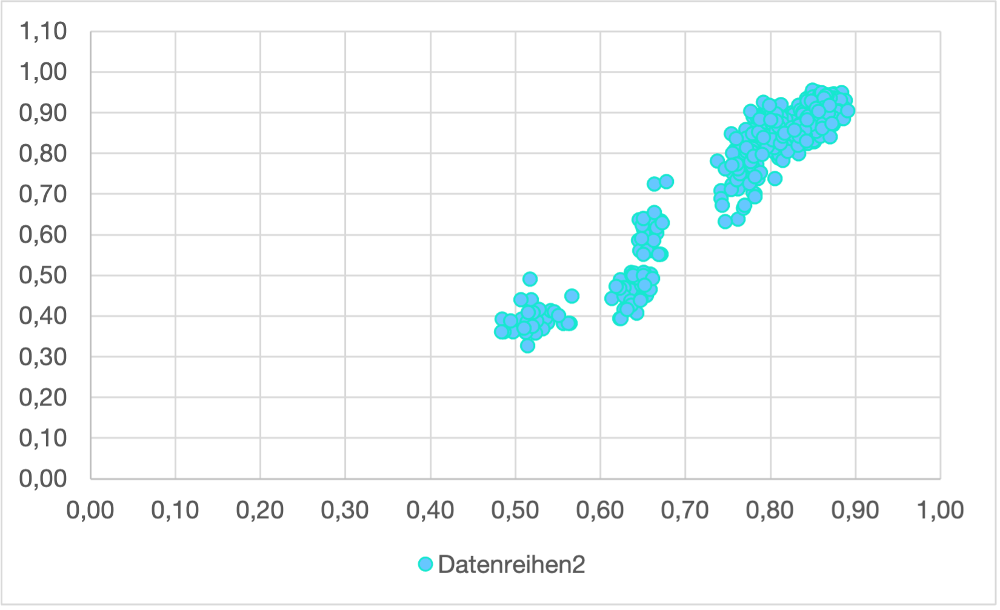
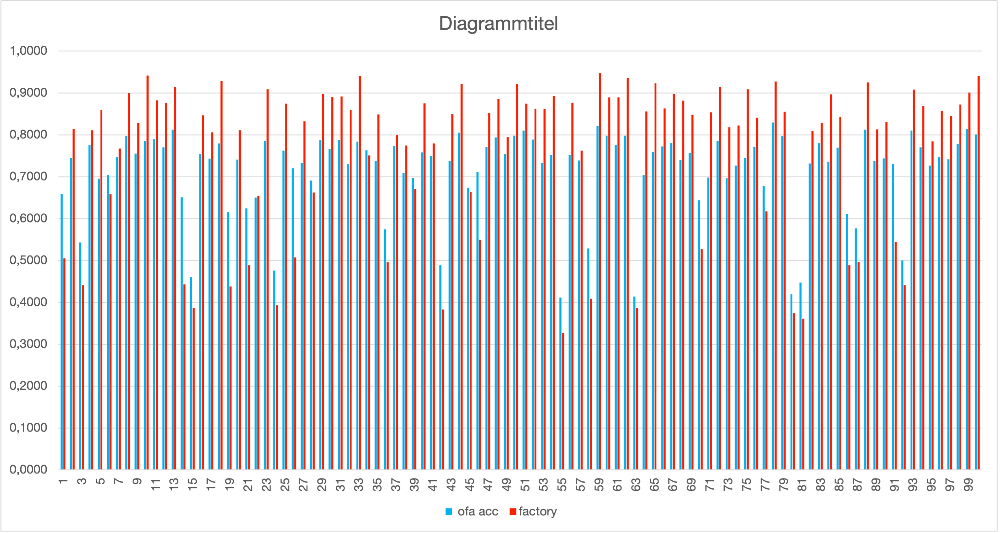
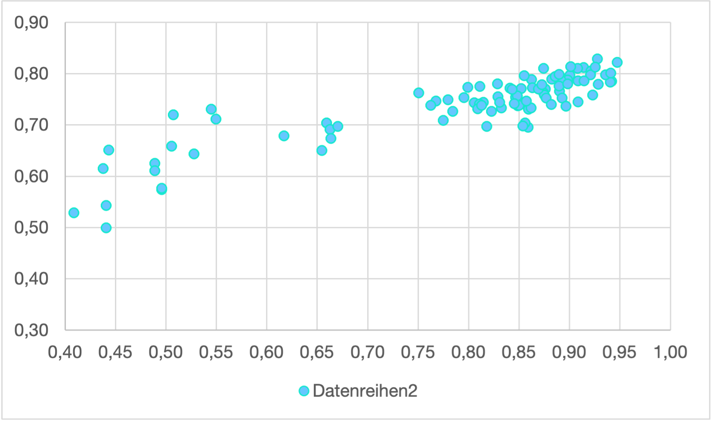
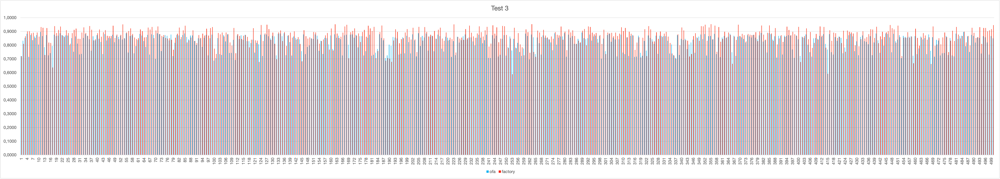
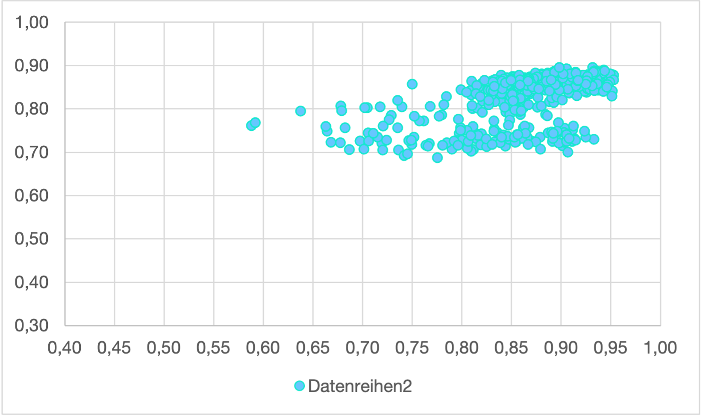

<!--
Copyright (c) 2022 University of Tübingen.

This file is part of hannah.
See https://atreus.informatik.uni-tuebingen.de/ties/ai/hannah/hannah for further info.

Licensed under the Apache License, Version 2.0 (the "License");
you may not use this file except in compliance with the License.
You may obtain a copy of the License at

    http://www.apache.org/licenses/LICENSE-2.0

Unless required by applicable law or agreed to in writing, software
distributed under the License is distributed on an "AS IS" BASIS,
WITHOUT WARRANTIES OR CONDITIONS OF ANY KIND, either express or implied.
See the License for the specific language governing permissions and
limitations under the License.
-->
# OFA (Once for All)

General Command Line Call for OFA is:

```shell
hannah-train --config-name nas_ofa
```

## Tests done with OFA

All the tests was run with the quantizized ofa model. Which could be found in `hannah/conf/model/ofa_quant.yaml`

During Ofa training, each random model are exported to a yaml config file. So that this model structure can be retrained from the beginning without having to use ofa. Thus the result of the ofa models can be compared 1 to 1 with those of the factory.

To do this, the exported models from `trained_models/nas_ofa/ofa/ofa_nas_dir/` must be copied to `hannah/conf/models/`
Afterwards the copied models can be trained with the factory.

The following code extracts all the accuracy from the multirun of the random models.

```python
import os

count = 100
output = "durchgang,Accuracy\n"

for i in range(count):
    filepath = str(i) + "/train.log"
    filecontent = None
    with open(filepath, "r") as f:
        filecontent = f.readlines()
    filecontent.reverse()
    for b in range(30):
        line = filecontent[b]
        if "test_accuracy" in line:
            break
    line = line.replace(" ","")
    line = line.replace("|test_accuracy|", "")
    index = line.find("|")
    accuracy = line[0:index]
    output += str(i)+ "," + str(accuracy) + "\n"


with open("output.csv", "w") as f:
    f.write(output)
```

To compare the data, the generated csv file and the csv file from ofa must be extended. All Bar charts and scatter Plots were created in excel with the data from the random test. The Ranking correlation errors were calculated with the same Data and the following Pytho Module [spearmanr](https://docs.scipy.org/doc/scipy/reference/generated/scipy.stats.spearmanr.html)

```python
result = scipy.stats.spearmanr(ofa, factory)
print("correlation: " + str(result.correlation))
```

### Test 1

Tested:

- kernel
- width
- depth with min depth 3 (std)

In this test case are 100 random models generated with ofa.

Command Line Call:

```shell
hannah-train --config-name nas_ofa nas.random_evaluate=True nas.extract_model_config=True
```

correlation: 0.48428648587261386






### Test 2

Tested:

- kernel
- width
- depth with min depth 2

In this test case are 500 random models generated with ofa.

Command Line Call:

```shell
hannah-train --config-name nas_ofa nas.random_evaluate=True nas.random_eval_number=500 model.min_depth=2 nas.extract_model_config=True
```

correlation: 0.8693632618251554





### Test 3

Tested:

- kernel
- width
- depth with min depth 2 (std)
- Dilation

In this test case are 100 random models generated with ofa.

Command Line Call:

```shell
hannah-train --config-name nas_ofa nas.random_evaluate=True nas.elastic_dilation_allowed=True model.min_depth=2 nas.extract_model_config=True
```

correlation: -0.9492795589815777





### Test 4

Tested:

- kernel
- width
- depth with min depth 3 (std)

In this test case are 500 random models generated with ofa.

Command Line Call for OFA is:

```shell
hannah-train --config-name nas_ofa nas.random_evaluate=True nas.random_eval_number=500 nas.extract_model_config=True
```

correlation: 0.5608241164301775




